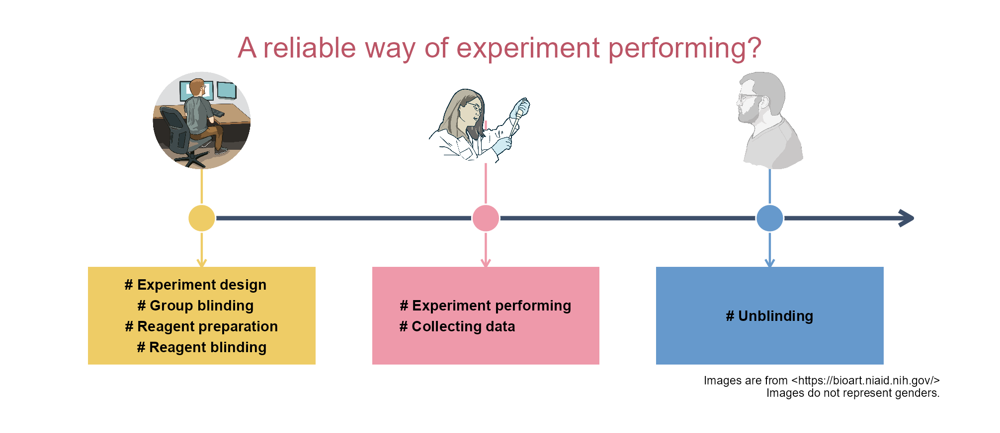

`耿同学讲故事`最近很流行，其主要是发现文章的造假等等。

这里列一个实验的执行策略，目的是为了得到客观的实验结果，省得给以后的自己挖坑。

{width="100%" fig-align="center"}

假如一个项目可拆解为100个实验，其中有多少个实验需要采用这个策略？

以下是生成如上图片的代码。

```{r}
#| eval: false
library(tidyplots)

# Create a data frame
df <- tibble::tibble(
    x = c(1, 2, 3, 3.5),
    y = rep(1, times = 4)
)

df

# Set several fixed locations/constants for efficient adjustment
text_up_dn <- 0.1 # vertical distance (tailored) to line
text_x <- df$x[1:3] # x axis locations (center) of texts
text_y <- df$y[1:3] - text_up_dn
rectangle_half_width <- 0.4 # half length (tailored) of rectangle behind text
rectangle_half_height <- 0.05
line_yend <- text_y + rectangle_half_height

labels <- c(
    "# Experiment design   \n# Group blinding   \n# Reagent preparation\n# Reagent blinding",
    "# Experiment performing\n# Collecting data              ",
    "# Unblinding")

person_a <- "images/person_a.png" |> 
    magick::image_read() |> 
    grid::rasterGrob()

person_b <- "images/person_b.png" |> 
    magick::image_read() |> 
    grid::rasterGrob()

person_c <- "images/person_c.png" |> 
    magick::image_read() |> 
    grid::rasterGrob()

# Plot
df |> tidyplot(x = x, y = y, color = y) |>  
    add_line(
        arrow = grid::arrow(length = grid::unit(0.25, "cm")),
        color = "#3d4f6a",
        linewidth = 1
    ) |> 
    add_annotation_rectangle(
        xmin = text_x - rectangle_half_width,
        xmax = text_x + rectangle_half_width,
        ymin = text_y + rectangle_half_height,
        ymax = text_y - rectangle_half_height,
        fill = c(c("#eecc66", "#ee99aa", "#6699cc")),
        alpha = 1
    ) |> 
    add_annotation_text(
        text = labels,
        x = text_x,
        y = text_y,
        fontface = "bold"
    ) |> 
    add_annotation_line(
        x = text_x,
        xend = text_x,
        y = 1.10,
        yend = line_yend,
        arrow = grid::arrow(length = grid::unit(0.15, "cm")),
        color = c("#eecc66", "#ee99aa", "#6699cc")
    ) |> 
    add(ggplot2::annotation_custom(person_a, xmin = 0.8, xmax = 1.2, ymin = 1.05, ymax = 1.15)) |>
    add(ggplot2::annotation_custom(person_b, xmin = 1.8, xmax = 2.2, ymin = 1.05, ymax = 1.15)) |> 
    add(ggplot2::annotation_custom(person_c, xmin = 2.8, xmax = 3.2, ymin = 1.05, ymax = 1.15)) |> 
    add_data_points(
        data = filter_rows(x <= 3), 
        size = 4, 
        white_border = TRUE,
        color = c("#eecc66", "#ee99aa", "#6699cc")) |> 
    adjust_title(
        title = "A reliable way of experiment performing?",
        fontsize = 14,
        color = "#bb5566") |> 
    add_caption(caption = "Images are from <https://bioart.niaid.nih.gov/>\nImages do not represent genders.") |> 
    adjust_size(width = 150) |> 
    adjust_x_axis(limits = c(0.5, 3.6)) |> 
    adjust_y_axis(limits = c(0.85, 1.15)) |> 
    remove_x_axis() |> 
    remove_y_axis() |> 
    save_plot("images/2026-05-13_experiment-performing.png",
        view_plot = FALSE)
```

[给我买杯茶🍵](给我买杯茶.qmd)