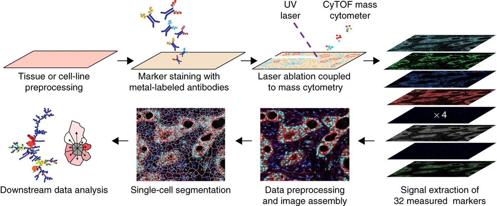
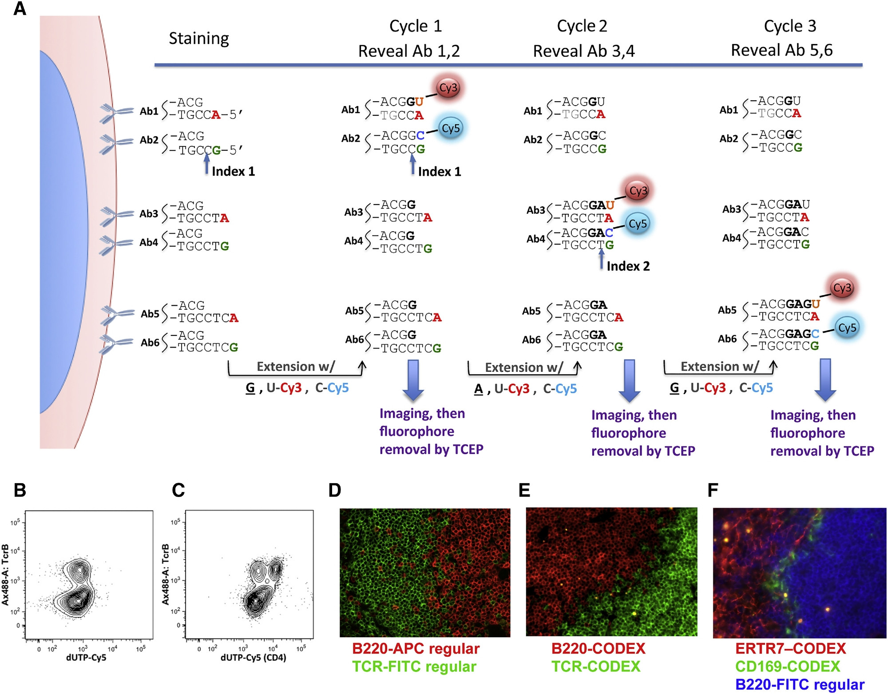
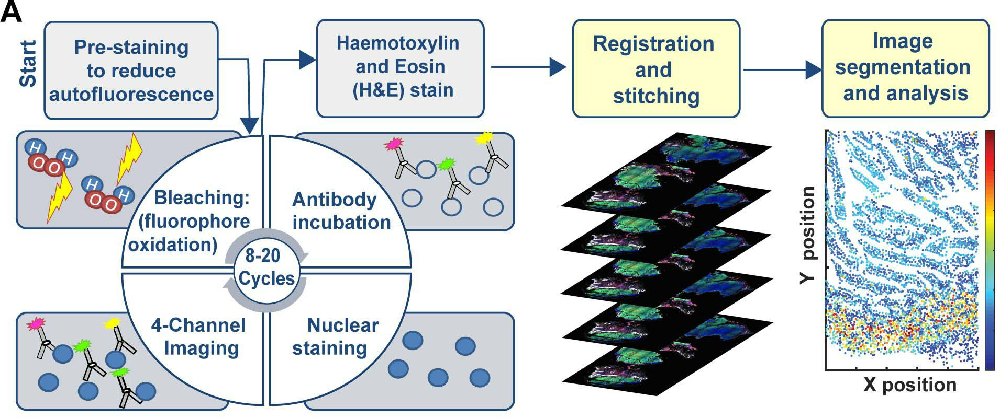
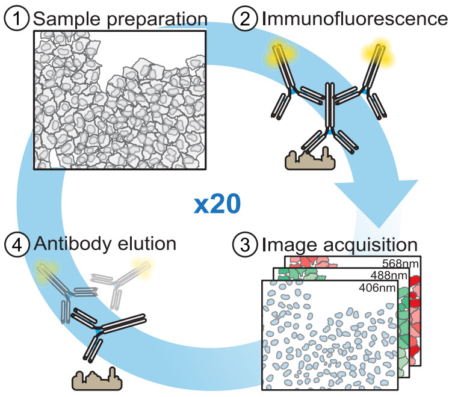
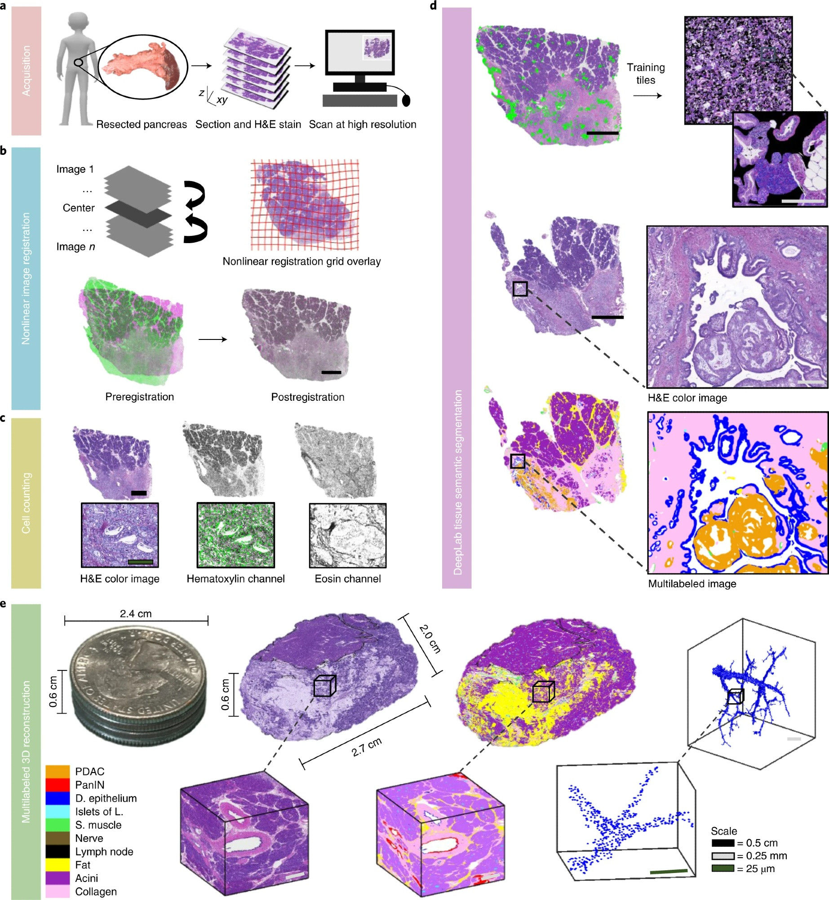
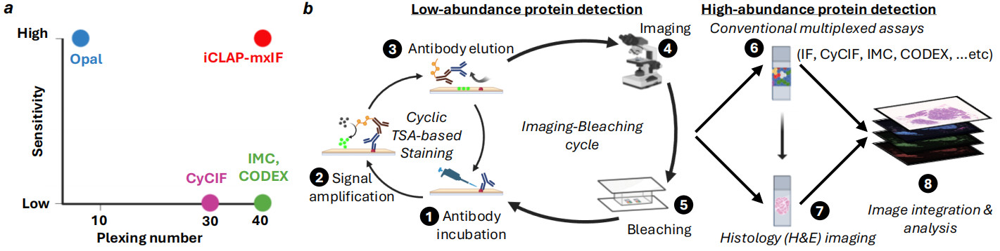

直接展示其原理图，不做过多描述。

## 1. IMC: imaging mass cytometry

> coupled immunohistochemical and immunocytochemical methods with high-resolution laser ablation to CyTOF mass cytometry [@Giesen2014].

{width="100%"}

## 2. CODEX: CO-Detection by indEXing

> Multiplexed DNA-tagged antibody staining [@Goltsev2018].

{width="100%"}

## 3. t-CyCIF: tissue-based cyclic immunofluorescence

> conventional low-plex fluorescence images are repeatedly collected from the same sample and then assembled into a high-dimensional representation [@Lin2018].

{width="100%"}

## 4. 4i: iterative indirect immunofluorescence imaging

{width="100%"}

![From [@Gut2018]](images/2026-03-04_science_2018_4i_legend.jpg){width="100%"}

## 5. CODA: quantitative 3D reconstruction of large tissues at cellular resolution

> CODA maps whole organs and organisms at single-cell resolution [@Kiemen2022], [@denis-wirtz2026].

{width="100%"}

## 6. iCLAP: integrable Co-detection of Low-Abundant Proteins

> enables sensitive and highly multiplexed protein detection within the same FFPE tissue section [@Wu2026].

{width="100%"}

[给我买杯茶🍵](给我买杯茶.qmd)

## References