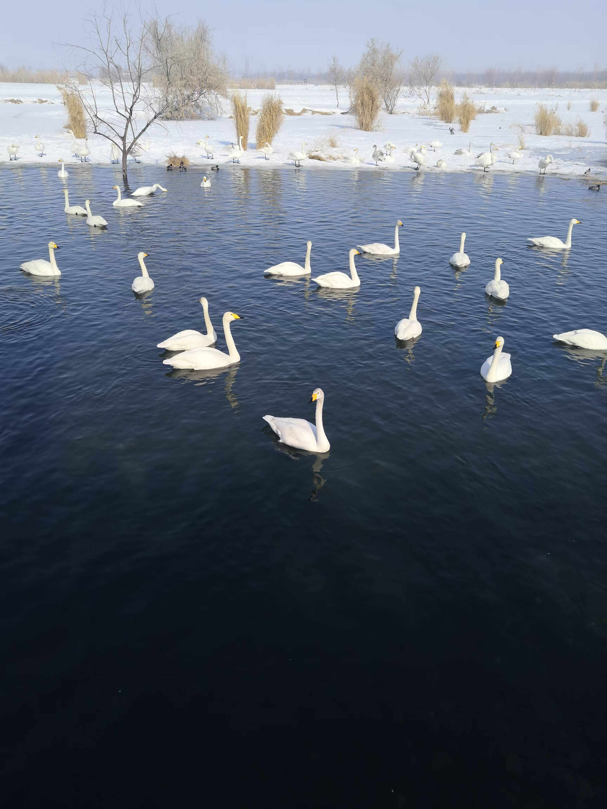
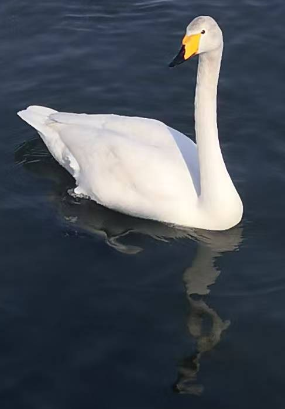
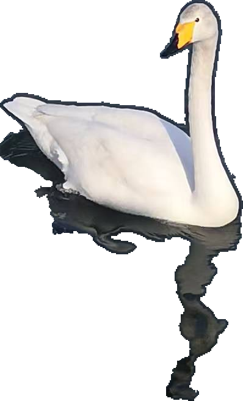

## 1. 在玛纳斯国家湿地公园拍到了天鹅

<div style="text-align: center;">
{style="border-radius: 8px; width: 100%;"}

天鹅湖（拍摄于2026-02-17）
</div>

## 2. 玛纳斯国家湿地公园的位置

``` {r}
#| message: false
sf |> library()
ggplot2 |> library()
ggtext |> library()

# Read the shapefile of Xinjiang
xinjiang <- "raw_data/新疆维吾尔自治区_市2.shp" |> 
    sf::read_sf()

# Set the position of 新疆玛纳斯国家湿地公园
wetland_park_location <- data.frame(
    x = 86.10,
    y = 44.25,
    z = "新疆玛纳斯国家湿地公园"
)

xinjiang |> ggplot() +
    geom_sf() +
    geom_point(
        data = wetland_park_location,
        aes(x = x, y = y),
        color = "red",
        size = 2
    ) +
    labs(
        x = "经度/longitude",
        y = "纬度/latitude",
        caption = "坐标来源：\nhttps://www.cj.gov.cn/p1/dfxfg/20170801/190939.html?source=zzb",
        title = "**玛纳斯国家湿地公园**位于<span style='color: red;'>红点</span>所示位置"
    ) +
    theme_void() +
    theme(
        plot.title = ggtext::element_markdown()
    )

"images/2026-03-10_wetland-position.png" |>
    ggsave(bg = "white")
```

## 3. 给离镜头最近的天鹅来个特写

QuPath建立project &rarr; 添加图片 &rarr; 就该天鹅画一个矩形注释框 &rarr; 导出该矩形注释框的图片。

<div style="text-align: center;">
{style="width: 50%; border-radius: 8px;"}

倒影很有意思
</div>

在QuPath &rarr; Classify &rarr; Pixel classification来选中天鹅和其倒影 &rarr; brush修补生成的annotation &rarr; 导出天鹅及其倒影。

<div style="text-align: center;">
{style="width: 50%; border: 1px solid gray; border-radius: 8px;"}
</div>

下面是groovy code：

```
// QuPath v0.7.0

/**
 * This exports the selected annotation and its ROI to ImageJ,
 * clears outside, and saves the output in a folder
 * called swan within your QuPath project.
 */

import ij.IJ
import qupath.lib.regions.RegionRequest
import qupath.imagej.tools.IJTools

def name = getCurrentImageNameWithoutExtension()

// Create output folder
outputPath = buildFilePath(PROJECT_BASE_DIR, "swan")
mkdirs(outputPath)

def imageData = getCurrentImageData()
def server = imageData.getServer()

def downsample = 1 // if the image is large, it could be enlarged
def anno = getSelectedObject()
def roi = anno.getROI()

// Request the region
def request = RegionRequest.createInstance(server.getPath(), downsample, roi)

// Extract the region as an ImageJ ImagePlus
def imp = IJTools.convertToImagePlus(server, request).getImage()

// Convert the QuPath ROI into an ImageJ
def ijRoi = IJTools.convertToIJRoi(roi, request)
imp.setRoi(ijRoi)
IJ.setBackgroundColor(255, 255, 255)
IJ.run(imp, "Clear Outside", "")

def nameExportSwan = name + "_swan" + ".png"

// Export the image with IJ
pathExport = buildFilePath(outputPath, nameExportSwan)
IJ.saveAs(imp, "png", pathExport)

println "Done! Image saved at: " + outputPath
```

Groovy代码参考自[@Isaac2025]并做小部分修改。

[给我买杯茶🍵](给我买杯茶.qmd)

## References