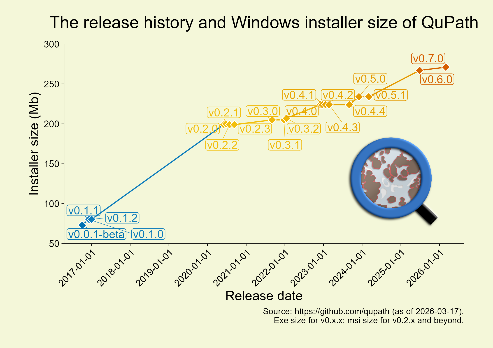

除过`v0.0.1-beta`（属于Pre-release），其它的pre-release版本不统计。

```{r}
#| message: false
#| warning: false

tidyplots |> library() # for plotting
ggplot2 |> library() # for plotting
magick |> library() # for reading image
grid |> library() # for changing image to graphic object

# Collect relevant data from https://github.com/qupath
qupath_history <- data.frame(
    Version = c(
        "v0.0.1-beta", "v0.1.0", "v0.1.1", "v0.1.2", "v0.2.0", "v0.2.1", "v0.2.2", "v0.2.3", "v0.3.0", "v0.3.1", "v0.3.2", "v0.4.0", "v0.4.1", "v0.4.2", "v0.4.3", "v0.4.4", "v0.5.0", "v0.5.1", "v0.6.0", "v0.7.0"
    ),
    Release_date = as.Date(
        c(
            "2016-10-05", "2016-12-05", "2016-12-08", "2017-01-01", "2020-06-01", "2020-06-23", "2020-07-28", "2020-09-11", "2021-09-03", "2021-12-24", "2022-01-17", "2022-12-03", "2022-12-21", "2023-01-20", "2023-02-23", "2023-09-02", "2023-12-02", "2024-03-04", "2025-06-27", "2026-03-02"
        )
    ),
    Installer_size = c(
        73, 80.3, 80.3, 80.4, 199, 200, 199, 199, 205, 205, 207, 224, 224, 224, 224, 224, 234, 234, 267, 271
    )
)

# Read the image of qupath
qupath <- "images/qupath.png" |> 
    magick::image_read()

qupath_grob <- qupath |> 
    grid::rasterGrob() # Change to graphic object

qupath_history |> tidyplot(x = Release_date, y = Installer_size, color = Installer_size) |> 
    add(ggplot2::geom_line(size = 0.6)) |>
    add_data_points(size = 2, white_border = TRUE, shape = 18) |> 
    add_data_labels_repel(label = Version, fontsize = 12, min.segment.length = 0) |>
    add_title("The release history and Windows installer size of QuPath") |> 
    add_caption(paste("Source: https://github.com/qupath (as of 2026-03-17).", "Exe size for v0.x.x; msi size for v0.2.x and beyond.", sep = "\n")) |> 
    adjust_size(width = 150, height = 75, unit = "mm") |> 
    adjust_font(fontsize = 10) |> 
    adjust_y_axis(limits = c(50, 300), breaks = seq(50, 300, 50)) |>
    adjust_x_axis(breaks = "1 year", ) |>
    add(ggplot2::theme(axis.text.x = element_text(angle = 45, vjust = 1, hjust = 1))) |> 
    add(ggplot2::annotation_custom(qupath_grob, xmin = as.Date("2023-07-01"), xmax = as.Date("2026-01-01"), ymin = 60, ymax = 200)) |> 
    adjust_x_axis_title(title = "Release date", fontsize = 14) |> 
    adjust_y_axis_title(title = "Installer size (Mb)", fontsize = 14) |>
    adjust_colors(new_colors = colors_discrete_friendly) |> 
    adjust_title(fontsize = 18, vjust = 3) |> 
    adjust_caption(fontsize = 9) |> 
    adjust_theme_details(plot.background = ggplot2::element_rect(fill = "#f4f7d9"), panel.background = ggplot2::element_rect(fill = "#f4f7d9")) |>
    adjust_legend_position(position = "none") |> 
    save_plot("images/2026-03-14_qupath-release-history-and-size.png", view_plot = FALSE)    
```

<div style="text-align: center;">
{style="width: 100%; border-radius: 8px;"}
</div>

::: {.callout-note icon="true"}
v0.x.x统计的是.exe格式文件的大小；v0.2.x及之后版本统计的是.msi格式文件的大小。
:::

[给我买杯茶🍵](给我买杯茶.qmd)