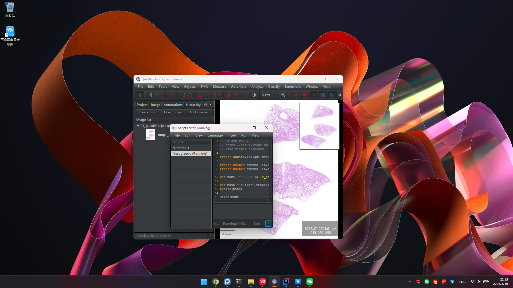
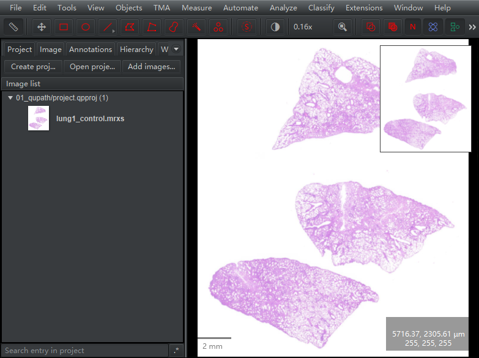
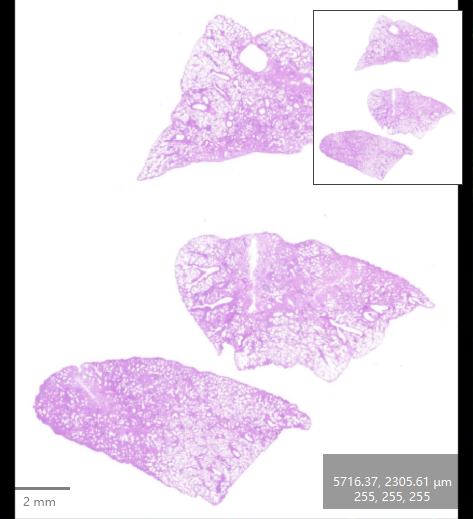
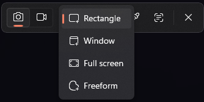
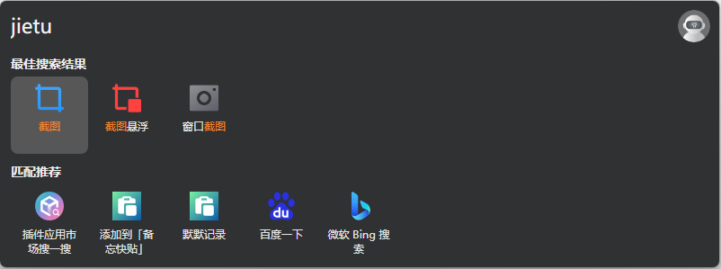

## 1，通过QuPath菜单

`File` &rarr; `Export snapshot...`

<center>
::: {.columns}
::: {.column width="37%"}
{style="width: 98%;"}
:::
::: {.column width="37%"}
{style="width: 98%;"}
:::
::: {.column width="26%"}
{style="width: 95%;"}
:::
:::
</center>

## 2，通过Extensions

`Extensions` &rarr; `Snapshot helper`

<center>
::: {.columns}
::: {.column width="50%"}
{style="width: 99%;"}
:::
::: {.column width="50%"}
{style="width: 95%;"}
:::
:::
</center>

## 3，通过groovy script

<center>
::: {.columns}
::: {.column width="37%"}
{style="width: 98%;"}
:::
::: {.column width="37%"}
{style="width: 98%;"}
:::
::: {.column width="26%"}
{style="width: 95%;"}
:::
:::
</center>

```
// QuPath v0.7.0

import qupath.lib.gui.tools.GuiTools

// Set directory
var path = buildFilePath(PROJECT_BASE_DIR, "images")
mkdirs(path)

// Export full screenshot
var name2 = "full-screenshot.png"
writeImage(
        GuiTools.makeFullScreenshot(),
        buildFilePath(path, name2)
)

// Export snapshot (main window content)
var name3 = "snapshot.png"
writeImage(
        GuiTools.makeSnapshot(),
        buildFilePath(path, name3)
)

// Export viewer snapshot
var name1 = "viewer-snapshot.png"
writeImage(
        GuiTools.makeViewerSnapshot(),
        buildFilePath(path, name1)
)

println "Done!"
```

## 4，&#8862; + `shift` + `S`唤起Windows自带的`Snipping Tool`

通过`Snipping Tool`截取（QuPath）任意窗口区域。

<center>
{style="width: 50%;"}
</center>

## 5，`alt` + `space`唤起`uTools` 

需要提前安装uTools。

唤起`uTools`后，在输入框输入`jietu`。三种工具都可以试试。

<center>

</center>

::: {.callout-note icon="true"}
方法1 - 3为QuPath特异的方法；方法4和5为泛泛的方法。
:::

[给我买杯茶🍵](给我买杯茶.qmd)