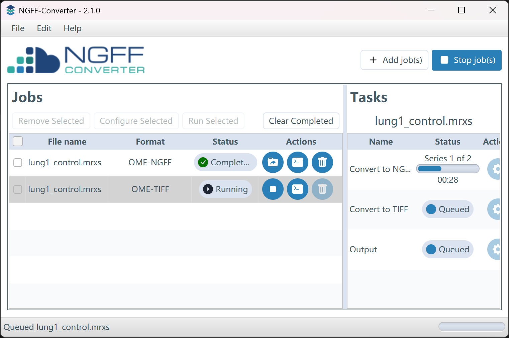
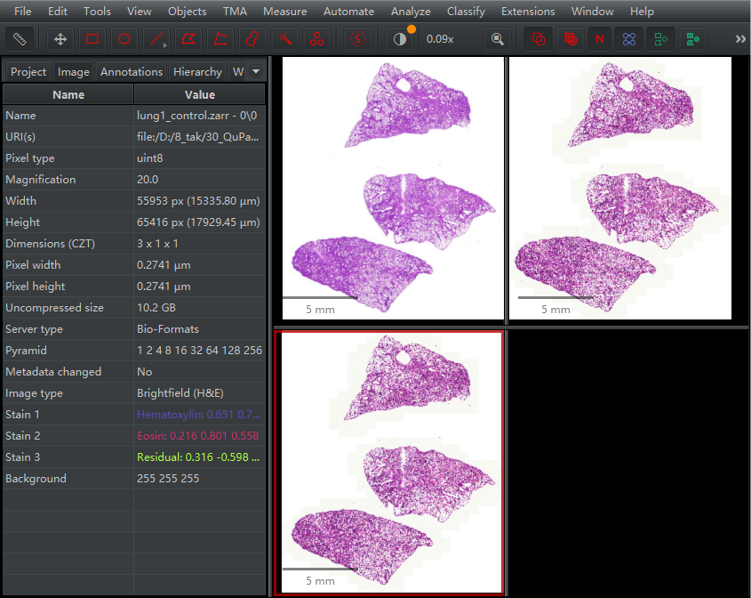
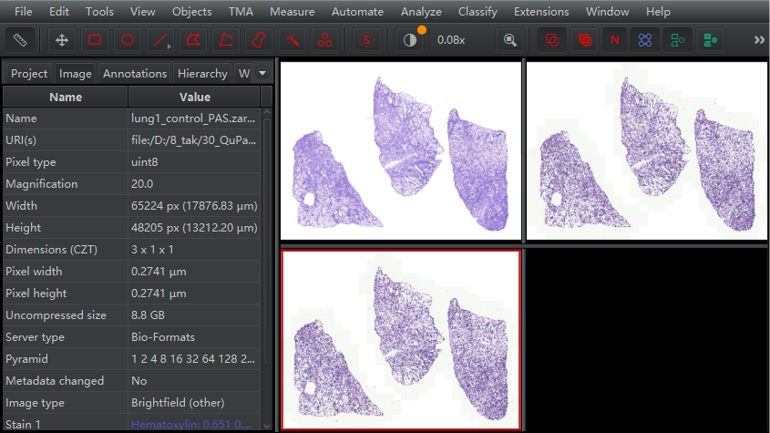
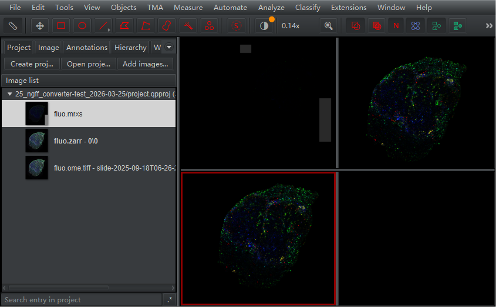

在某些情况下，可能QuPath不能正确的打开mrxs格式图片[@QuPath_mrxs2026], [@iAmHealthy_mrxs]。

在这里通过NGFF-Converter（Glencoe SOFTWARE，美国；<https://www.glencoesoftware.com/products/ngff-converter/>）尝试将mrxs格式图片（即HE切片、PAS切片、和多色荧光切片）转为OME-NGFF和OME-TIFF格式，并在QuPath打开测试。

## 1. mrxs格式HE图片转为OME-NGFF和OME-TIFF格式

{style="width: 100%; border: 1px solid gray; border-radius: 6px;"}

图片格式转换界面。

{style="width: 100%; border: 1px solid gray; border-radius: 6px;"}

mrxs（左上；server type：OpenSlide）、OME-NGFF（左下；server type：Bio-Formats）、和OME-TIFF（右上；server type：Bio-Formats）。Server type由QuPath决定。

肉眼感觉mrxs和OME图片的颜色不统一？可能是因为彼此默认的server type不同（或其它原因）导致的，**但对应像素的rgb值是相同的**，因此不用担心。

## 2. mrxs格式PAS图片转为OME-NGFF和OME-TIFF格式

{style="width: 100%; border: 1px solid gray; border-radius: 6px;"}

mrxs（左上；server type：OpenSlide）、OME-NGFF（左下；server type：Bio-Formats）、和OME-TIFF（右上；server type：Bio-Formats）。Server type由QuPath决定。

## 3. mrxs格式多色荧光图片转为OME-NGFF和OME-TIFF格式

{style="width: 100%; border: 1px solid gray; border-radius: 6px;"}

mrxs（左上；server type：OpenSlide）、OME-NGFF（左下；server type：Bio-Formats）、和OME-TIFF（右上；server type：Bio-Formats）。Server type由QuPath决定。

mrxs格式多色荧光图片不能被QuPath正确打开：识别成了rgb图片（即无荧光通道信息）；没有金字塔信息；图片含有矩形灰色区域[@iAmHealthy_mrxs]。

转换后的OME-NGFF和OME-TIFF则能被QuPath正确打开。

**如果遇到其它软件不能正确打开mrxs时，不妨用NGFF-Converter转换为OME-NGFF或OME-TIFF试试。**

## References