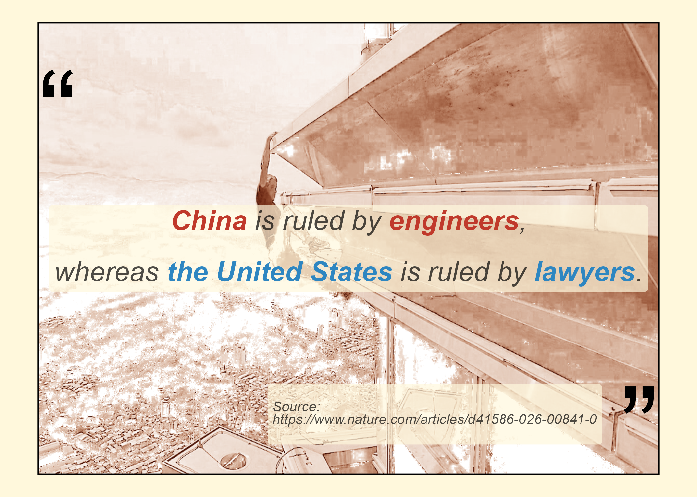

```{r}
#| eval: false
#| code-overflow: scroll
"ggplot2" |> library()
"ggtext" |> library()
"tibble" |> library()
"magick" |> library()
"grid" |> library()

df <- tibble(
    label = c(
        "<span style='font-size: 20pt;'><i><b><span style='color: #C0392B;'>China</span></b> is ruled by <b><span style='color: #C0392B;'>engineers</span></b>,<br><br>whereas <b><span style='color: #2E86C1;'>the United States</span></b> is ruled by <b><span style='color: #2E86C1;'>lawyers</span></b>.</i></span>",

        "<span style='font-size: 10pt;'>
            <i>Source: https://www.nature.com/articles/d41586-026-00841-0</i>
        </span>"
    ),
    x = c(.5, .9),
    y = c(.5, .2),
    hjust = c(0.5, 1),
    vjust = c(0.5, 1),
    color = c("black", "black")
)

# Read the image
alex <- "images/56_Alex_Honold_dab.png" |> 
    magick::image_read()

alex_grob <- alex |> 
    grid::rasterGrob(width = unit(1, "npc"), height = unit(1, "npc")) # Convert the image to a grob object

df |> ggplot() +
    aes(
        x, y, label = label, hjust = hjust, vjust = vjust, color = color
    ) +
    scale_color_identity() +
    annotation_custom(alex_grob, xmin = 0.01, xmax = 0.99, ymin = 0, ymax = 1) +
    geom_richtext(fill = "cornsilk", label.color = NA, alpha = 0.7) +
    xlim(0, 1) + ylim(0, 1) +
    annotate("rect", xmin = 0.01, xmax = 0.99, ymin = 0, ymax = 1, fill = NA, color = "black") +
    annotate("text", x = 0.01, y = 0.8, label = "“", hjust = 0, vjust = 0.5, size = 30) +
    annotate("text", x = 0.99, y = 0.1, label = "”", hjust = 1, vjust = 0.5, size = 30) +
    theme_void() +
    theme(
        plot.background = element_rect(fill = "cornsilk")
    )

"images/2026-03-26_quote-of-the-day.png" |> ggsave()
```

<center>
{style="width: 100%; border-radius: 6px;"}
</center>

:::{.callout-note icon="true"}
背景图片来自<https://www.netflix.com/tudum/articles/how-to-watch-alex-honnold-skyscraper-climb-live-netflix>，并通过QuPath进行了color deconvolution [@iAmHealthy_alex]。
:::

## References