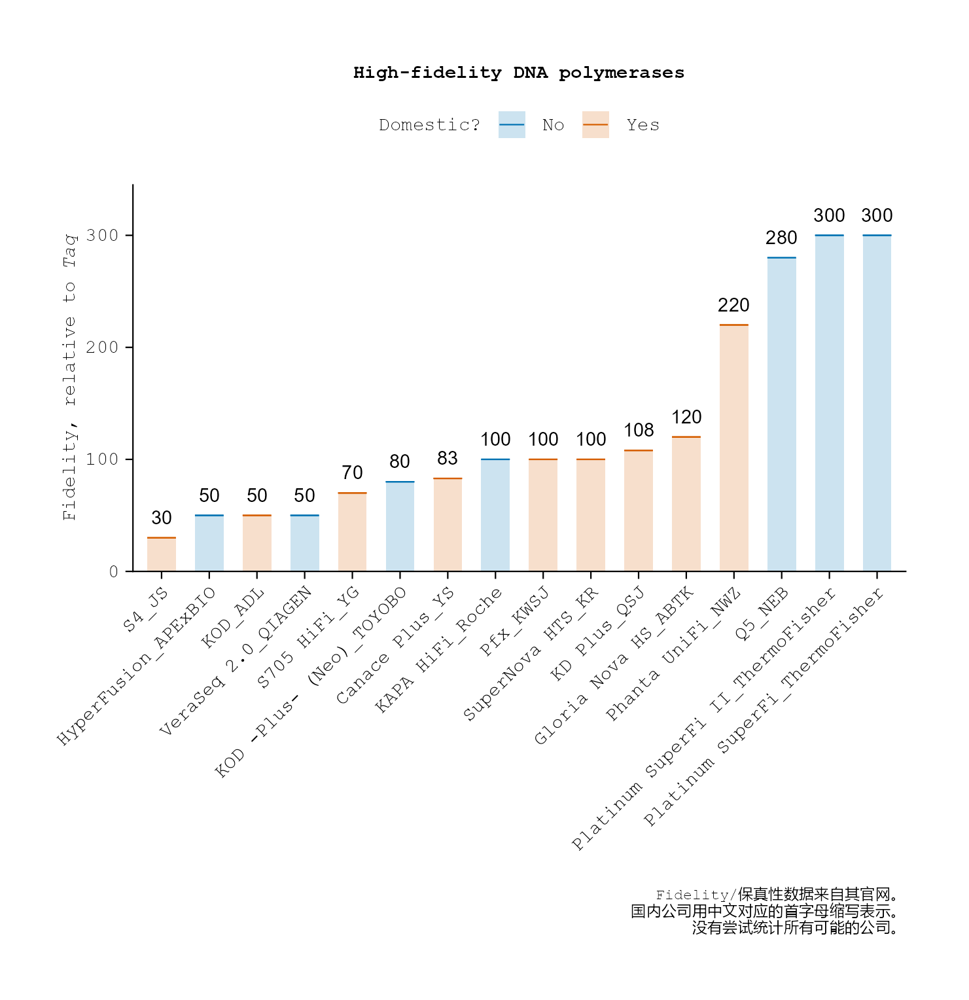
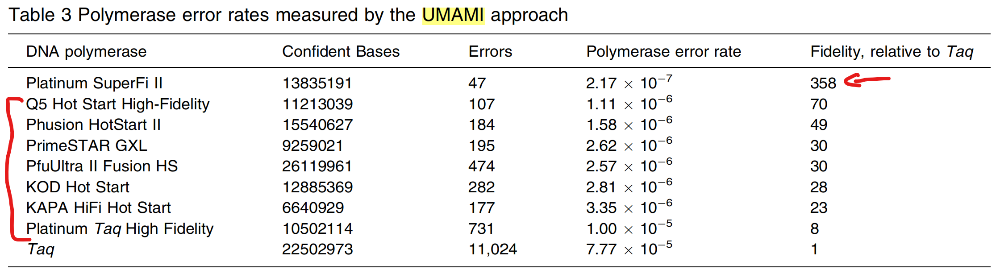

几乎每个和生物相关的个人可能都用过高保真DNA聚合酶（high-fidelity DNA polymerase）。

这里较系统的比较不同公司的高保真DNA聚合酶的保真性（相比于<i>Taq</i> DNA聚合酶）。

::: {.callout-note icon="true"}
- 一个公司大概选一种保真性最高的DNA聚合酶（若该公司有多种高保真DNA聚合酶）。

- 保真性参数来自其公司产品网页的描述（因此数据真实性由公司负责）。

- 若某个公司未提及其高保真DNA聚合酶的保真性参数（即相比于<i>Taq</i>DNA聚合酶），则不统计该酶。
:::

## 1. 读取整理的数据表格并展示

<center>
{style="width: 100%;"}
</center>

以下是R code。
```{r}
#| eval: false
#| message: false

readxl |> library()
dplyr |> library()
tidyplots |> library()
ggtext |> library()

hifi <- "raw_data/2026-03-27_proofread-dna-polymerases.xlsx" |> 
    readxl::read_xlsx(col_names = TRUE)

hifi <- hifi |> 
    mutate(dna_polymerase_provider = paste(`proofread-dna-polymerase`, provider_1, sep = "_"))

hifi <- hifi |> 
    mutate(domestic = as.factor(domestic))

hifi |> tidyplots::tidyplot(x = dna_polymerase_provider, y = `fidelity-than-taq`, color = domestic) |> 
    add_sum_bar(alpha = 0.2) |>
    add_sum_dash() |>
    add_sum_value(accuracy = 1, color = "black") |> 
    sort_x_axis_labels() |> 
    adjust_x_axis(rotate_labels = TRUE, title = "") |> 
    adjust_y_axis_title("Fidelity, relative to *Taq*") |> 
    adjust_size(width = 100) |> 
    adjust_legend_title("Domestic?") |> 
    adjust_legend_position(position = "top") |> 
    adjust_font(family = "mono") |> 
    adjust_title("High-fidelity DNA polymerases", face = "bold") |> 
    adjust_caption(paste("Fidelity/保真性数据来自其官网。", "国内公司用中文对应的首字母缩写表示。", "没有尝试统计所有可能的公司。", sep = "\n")) |> 
    add(ggplot2::theme(axis.title.y = ggtext::element_markdown())) |> 
    save_plot("images/2026-03-29_high-fidelity-dna-polymerases.png")
```

## 2. ThermoFisher公布的测试比较

ThermoFisher于2021年[@Mielinis2021]基于Unique MuA-based Molecular Indexing（UMAMI）技术策略比较了几种高保真DNA聚合酶的保真性。

<center>
{style="width: 100%;"}
</center>

[给我买杯茶🍵](给我买杯茶.qmd)

## References