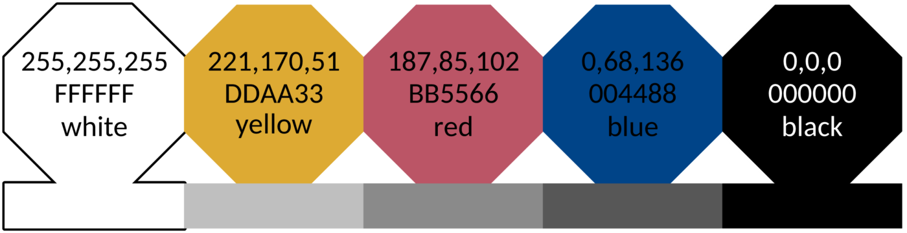
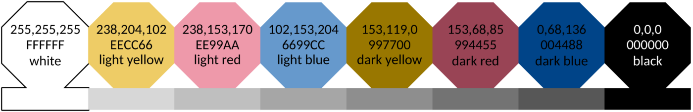

就研究产生数据的图片展示过程中，大家大概率会选择<mark>彩色图案</mark>。

若发现研究结果有创新性和潜在商业可转化性，这些彩色图案可能会被用于专利申请。

但专利申请的附图`一般使用黑色墨水绘制，必要时可以提交彩色附图，以便清楚描述专利申请的相关技术内容`[@cnipa_figure-color]。

因此对于彩色图案，最好选择合适的配色方案，以便将图案转为黑白图片后，颜色反差依然显著（即一次图片展示满足彩色图案和黑白图案的对比需求）。

这个网页<https://sronpersonalpages.nl/~pault/>提到两套彩色配色方案[@paul_colors]，可满足如上需求。

## 1. 定性配色方案1

<center>


> <b>高对比度定性配色方案</b>。该方案对色盲人士友好，并针对对比度进行了优化。下方为具有相同亮度的灰色调，此方案同样适用于单色视觉人群以及黑白打印输出。
</center>

把这个配色方案用R测试之。

```{r}
#| eval: true
#| warning: false
#| code-line-numbers: true

tidyplots |> library()
tibble |> library()
ggplot2 |> library()
magick |> library()
grid |> library()

df <- tibble::tibble(
    y = c(1, 2, 3, 4, 5),
    x = c("a", "b", "c", "d", "e")
)

df |> tidyplots::tidyplot(x = x, y = y, color = x) |> 
    add(ggplot2::geom_bar(stat = "identity", color = "#000000", width = 0.6, linewidth = 0.5)) |> 
    adjust_legend_position(position = "none") |> 
    save_plot("images/2026-03-30_1_default.png", padding = 0.01, view_plot = FALSE) |> 
    adjust_colors(new_colors = c(
        "a" = "#ffffff",
        "b" = "#ddaa33",
        "c" = "#bb5566",
        "d" = "#004488",
        "e" = "#000000"
    )) |> 
    save_plot("images/2026-03-30_scheme1.png", padding = 0.01, view_plot = FALSE)

default <- "images/2026-03-30_1_default.png" |> 
    magick::image_read()

# change to gray image and save
default_gray <- default |> 
    image_convert(colorspace = "gray") |> 
    image_write("images/2026-03-30_1_default_gray.png", format = "png")

scheme1 <- "images/2026-03-30_scheme1.png" |> 
    magick::image_read()

# change to gray image and save
scheme1_gray <- scheme1 |> 
    image_convert(colorspace = "gray") |> 
    image_write("images/2026-03-30_scheme1_gray.png", format = "png")

# put the four (i.e. default, default_gray, scheme1, and scheme1_gray) images together
df |> rm()
df <- tibble::tibble(
    x = c(seq(1, 100)),
    y = c(seq(1, 100))
)

default <- default |> 
    grid::rasterGrob(width = unit(1, "npc"), height = unit(1, "npc"))
default_gray |> rm()
default_gray <- "images/2026-03-30_1_default_gray.png" |> 
    magick::image_read() |>  
    grid::rasterGrob(width = unit(1, "npc"), height = unit(1, "npc"))
scheme1 <- scheme1 |> 
    grid::rasterGrob(width = unit(1, "npc"), height = unit(1, "npc"))
scheme1_gray |> rm()
scheme1_gray <- "images/2026-03-30_scheme1_gray.png" |> 
    magick::image_read() |>  
    grid::rasterGrob(width = unit(1, "npc"), height = unit(1, "npc"))

df |> tidyplots::tidyplot(x = x, y = y) |> 
    add_data_points(alpha = 0) |> 
    add(ggplot2::annotation_custom(default, xmin = 5, xmax = 50, ymin = 50, ymax = 95)) |> 
    add(ggplot2::annotation_custom(default_gray, xmin = 55, xmax = 100, ymin = 50, ymax = 95)) |> 
    add(ggplot2::annotation_custom(scheme1, xmin = 5, xmax = 50, ymin =0, ymax = 45)) |> 
    add(ggplot2::annotation_custom(scheme1_gray, xmin = 55, xmax = 100, ymin =0, ymax = 45)) |> 
    add_annotation_text("A", x = 3, y = 95, fontsize = 10, face = "bold") |> 
    add_annotation_text("B", x = 53, y = 95, fontsize = 10, face = "bold") |> 
    add_annotation_text("C", x = 3, y = 45, fontsize = 10, face = "bold") |> 
    add_annotation_text("D", x = 53, y = 45, fontsize = 10, face = "bold") |> 
    add_annotation_text("Default color", x = 30, y = 90) |> 
    add_annotation_text(paste("Default color", "gray", sep = "\n"), x = 80, y = 90) |> 
    add_annotation_text("Scheme 1", x = 30, y = 40) |> 
    add_annotation_text(paste("Scheme 1", "gray", sep = "\n"), x = 80, y = 40) |> 
    add(ggplot2::geom_segment(aes(x = 50, y = 75, xend = 55, yend = 75), arrow = arrow(length = unit(0.2, "cm")), color = "#bbbbbb", linewidth = 1)) |> 
    add(ggplot2::geom_segment(aes(x = 50, y = 25, xend = 55, yend = 25), arrow = arrow(length = unit(0.2, "cm")), color = "#bbbbbb", linewidth = 1)) |>
    adjust_size(width = 150, height = 150) |> 
    remove_x_axis() |>
    remove_y_axis() |> 
    save_plot("images/2026-03-31_scheme1.png", padding = 0, view_plot = TRUE)
```

能够看出来：<mark>若考虑对应灰度图的反差度或区分度，彩色配色方案1胜出。</mark>

## 2. 定性配色方案2

<center>


> <b>中等对比度的定性颜色方案。</b>该方案对色盲友好且包含更多颜色。同时，它也针对对比度进行了优化，以便在黑白打印输出中仍然可用，但颜色之间的差异不可避免地会变小。
</center>

同样用R测试下这个配色方案。

```{r}
#| eval: true
#| warning: false
#| code-fold: true
#| code-summary: "Show code"
#| code-line-numbers: true

tidyplots |> library()
tibble |> library()
ggplot2 |> library()
magick |> library()

df <- tibble(
    y = c(1, 2, 3, 4, 5, 6, 7, 8),
    x = c("a", "b", "c", "d", "e", "f", "g", "h")
)

df |> tidyplot(x = x, y = y, color = x) |> 
    add(ggplot2::geom_bar(stat = "identity", color = "#000000", width = 0.6, linewidth = 0.5)) |> 
    adjust_legend_position(position = "none") |> 
    save_plot("images/2026-03-30_2_default.png", padding = 0.01, view_plot = FALSE) |> 
    adjust_colors(new_colors = c(
        "a" = "#ffffff",
        "b" = "#eecc66",
        "c" = "#ee99aa",
        "d" = "#6699cc",
        "e" = "#997700",
        "f" = "#994455",
        "g" = "#004488",
        "h" = "#000000"
    )) |> 
    save_plot("images/2026-03-30_scheme2.png", padding = 0.01, view_plot = FALSE)


default <- "images/2026-03-30_2_default.png" |> 
    magick::image_read()

# change to gray image and save
default_gray <- default |> 
    image_convert(colorspace = "gray") |> 
    image_write("images/2026-03-30_2_default_gray.png", format = "png")

scheme2 <- "images/2026-03-30_scheme2.png" |> 
    magick::image_read()

# change to gray image and save
scheme2_gray <- scheme2 |> 
    image_convert(colorspace = "gray") |> 
    image_write("images/2026-03-30_scheme2_gray.png", format = "png")

# put the four (i.e. default, default_gray, scheme2, and scheme2_gray) images together
df |> rm()
df <- tibble::tibble(
    x = c(seq(1, 100)),
    y = c(seq(1, 100))
)

default <- default |> 
    grid::rasterGrob(width = unit(1, "npc"), height = unit(1, "npc"))
default_gray |> rm()
default_gray <- "images/2026-03-30_2_default_gray.png" |> 
    magick::image_read() |>  
    grid::rasterGrob(width = unit(1, "npc"), height = unit(1, "npc"))
scheme2 <- scheme2 |> 
    grid::rasterGrob(width = unit(1, "npc"), height = unit(1, "npc"))
scheme2_gray |> rm()
scheme2_gray <- "images/2026-03-30_scheme2_gray.png" |> 
    magick::image_read() |>  
    grid::rasterGrob(width = unit(1, "npc"), height = unit(1, "npc"))

df |> tidyplots::tidyplot(x = x, y = y) |> 
    add_data_points(alpha = 0) |> 
    add(ggplot2::annotation_custom(default, xmin = 5, xmax = 50, ymin = 50, ymax = 95)) |> 
    add(ggplot2::annotation_custom(default_gray, xmin = 55, xmax = 100, ymin = 50, ymax = 95)) |> 
    add(ggplot2::annotation_custom(scheme2, xmin = 5, xmax = 50, ymin =0, ymax = 45)) |> 
    add(ggplot2::annotation_custom(scheme2_gray, xmin = 55, xmax = 100, ymin =0, ymax = 45)) |> 
    add_annotation_text("A", x = 3, y = 95, fontsize = 10, face = "bold") |> 
    add_annotation_text("B", x = 53, y = 95, fontsize = 10, face = "bold") |> 
    add_annotation_text("C", x = 3, y = 45, fontsize = 10, face = "bold") |> 
    add_annotation_text("D", x = 53, y = 45, fontsize = 10, face = "bold") |> 
    add_annotation_text("Default color", x = 30, y = 90) |> 
    add_annotation_text(paste("Default color", "gray", sep = "\n"), x = 80, y = 90) |> 
    add_annotation_text("Scheme 2", x = 30, y = 40) |> 
    add_annotation_text(paste("Scheme 2", "gray", sep = "\n"), x = 80, y = 40) |> 
    add(ggplot2::geom_segment(aes(x = 50, y = 75, xend = 55, yend = 75), arrow = arrow(length = unit(0.2, "cm")), color = "#bbbbbb", linewidth = 1)) |> 
    add(ggplot2::geom_segment(aes(x = 50, y = 25, xend = 55, yend = 25), arrow = arrow(length = unit(0.2, "cm")), color = "#bbbbbb", linewidth = 1)) |>
    adjust_size(width = 150, height = 150) |> 
    remove_x_axis() |>
    remove_y_axis() |> 
    save_plot("images/2026-03-31_scheme2.png", padding = 0, view_plot = TRUE)
```

结论不变：<mark>若考虑对应灰度图的反差度或区分度，彩色配色方案2胜出。</mark>

## References