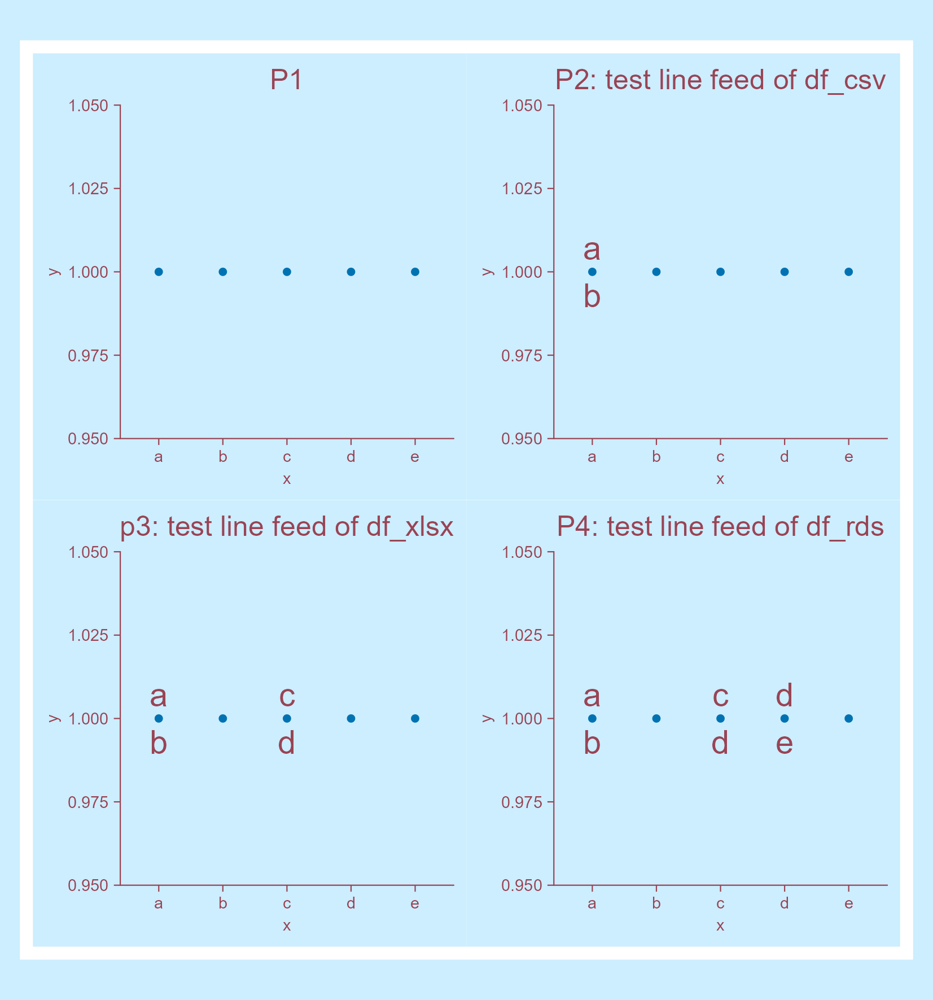

## 1. 先生成一个示例data frame

```{r}
# Generate a tibble
df <- tibble::tibble(
    x = letters[1:5],
    y = rep(1, 5),
    labels = c("a\nb", "b\nc", "c\nd", "d\ne", "e\nf")
)

# View df
df
```

## 2. 将df分别存储为csv、txt、xlsx、和rds格式

```{r}
# Save as csv
df |> 
    readr::write_csv(file = "raw_data/2026-04-26_line-feed.csv")

# Save as txt
df |> 
    readr::write_tsv("raw_data/2026-04-26_line-feed.txt")

# Save as excel
df |> 
    writexl::write_xlsx("raw_data/2026-04-26_line-feed.xlsx")

# Save as rds
df |> 
    readr::write_rds("raw_data/2026-04-26_line-feed.rds")

# View the saved files
"raw_data/" |> 
    fs::dir_tree(regexp = "^raw_data/2026-04-26_line-feed")
```

## 3. 读取存储的4个文件

```{r}
#| warning: false
# read csv file
df_csv <- 
    "raw_data/2026-04-26_line-feed.csv" |> 
    readr::read_csv(show_col_types = FALSE)

# view
df_csv

# read txt file
df_txt <- 
    "raw_data/2026-04-26_line-feed.txt" |> 
    readr::read_tsv(show_col_types = FALSE)

# view
df_txt

# read xlsx file
df_xlsx <- 
    "raw_data/2026-04-26_line-feed.xlsx" |> 
    readxl::read_xlsx()

# view
df_xlsx

# read rds file
df_rds <- 
    "raw_data/2026-04-26_line-feed.rds" |> 
    readr::read_rds()

# view
df_rds
```

[看来若df中含有`\n`，则不能把df存储为tsv格式。]{.mark}

## 4. 测试换行符在plot的表现

```{r}
#| warning: false
tidyplots |> library()

p1 <- df |> 
    tidyplot(x = x, y = y, paper = "#cceeff", ink = "#994455") |> 
    add_data_points() |> 
    add_title(title = "P1") |> 
    adjust_title(fontsize = 12)

p2 <- p1 |> 
    add_annotation_text(
        text = df_csv$labels[1],
        x = "a", y = 1, fontsize = 14) |> 
    adjust_title(title = "P2: test line feed of df_csv")

p3 <- p2 |> 
    add_annotation_text(
        text = df_xlsx$labels[3],
        x = "c", y = 1, fontsize = 14) |> 
    adjust_title(title = "p3: test line feed of df_xlsx")

p4 <- p3 |> 
    add_annotation_text(
        text = df_rds$labels[4],
        x = "d", y = 1, fontsize = 14) |> 
    adjust_title(title = "P4: test line feed of df_rds")

patchwork::wrap_plots(p1, p2, p3, p4, ncol = 2) |> 
    save_plot("images/2026-04-26_line-feed.png",
        view_plot = FALSE, width = 140, height = 150)
```

</center>

</center>

换行符确实在plot中让换行了😁。