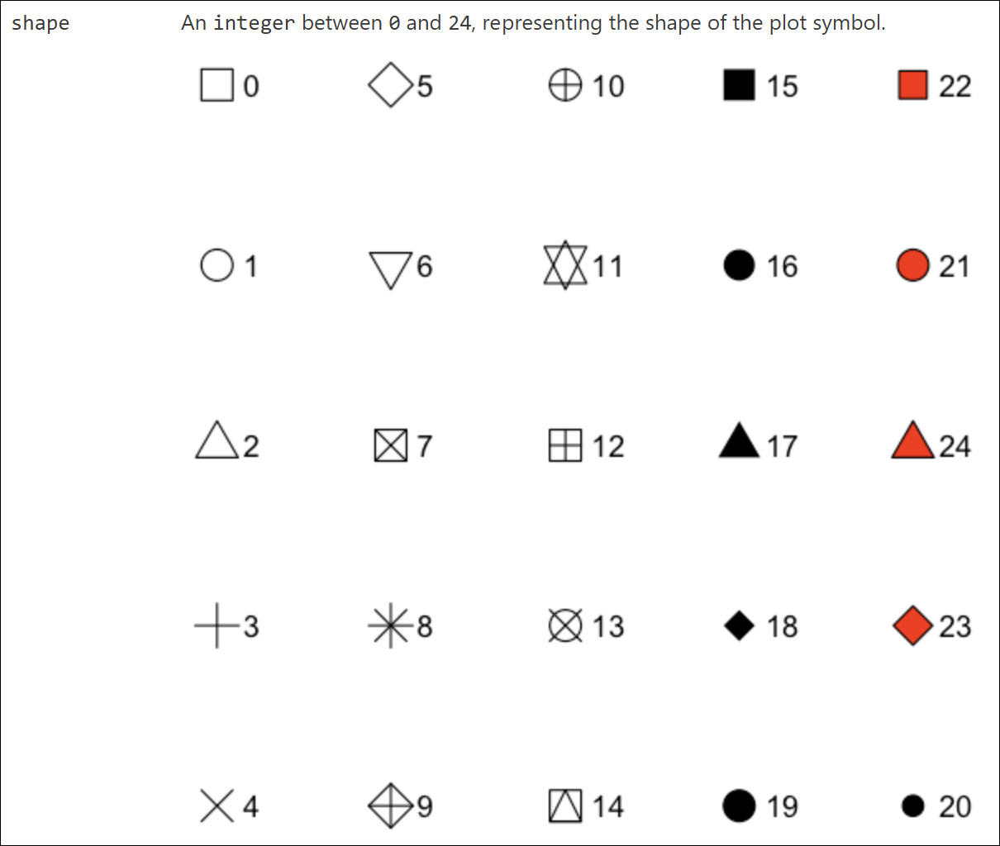

在R console中输入`?tidyplots::add_data_points`，会显示该函数的help信息，从中可知其中的`shape`参数：

> An integer between 0 and 24, representing the shape of the plot symbol.

```{r}
#| eval: false
#| echo: false
img <- "images/2026-04-29_shapes-in-tidyplots.png" |> 
    magick::image_read() |> 
    magick::image_border(color = "#000000", geometry = "1x1") |> 
    magick::image_write("images/2026-04-29_shapes-in-tidyplots_border.png")
```

{width="100%" fig-align="center"}

```{r}
#| warning: false
tidyplots |> library()

# Set a df for point plotting
df <- tibble::tibble(
    x = rep(1:20, length.out = 200),
    y = rep(letters[1:10], each = 20),
    shape = seq(0, 199) # testing more numbers here
)

df |> tidyplot(x = x, y = y) |> 
    add_data_points(shape = df$shape, size = 3, color = "#000000", fill = "#bb5566") |> 
    add_annotation_text(text = df$shape, x = df$x, y = df$y, vjust = 2.5, color = "#6699cc") |> 
    adjust_size(width = 150, height = 100) |> 
    adjust_y_axis(limits = c(0.3, NA)) |>  
    remove_x_axis_labels() |> remove_y_axis_labels() |> 
    remove_x_axis_title() |> remove_y_axis_title() |> 
    add_title("Just shapes 21 - 25 in tidyplots use both 'color' and 'fill' parameters")
```

[给我买杯茶🍵](给我买杯茶.qmd)