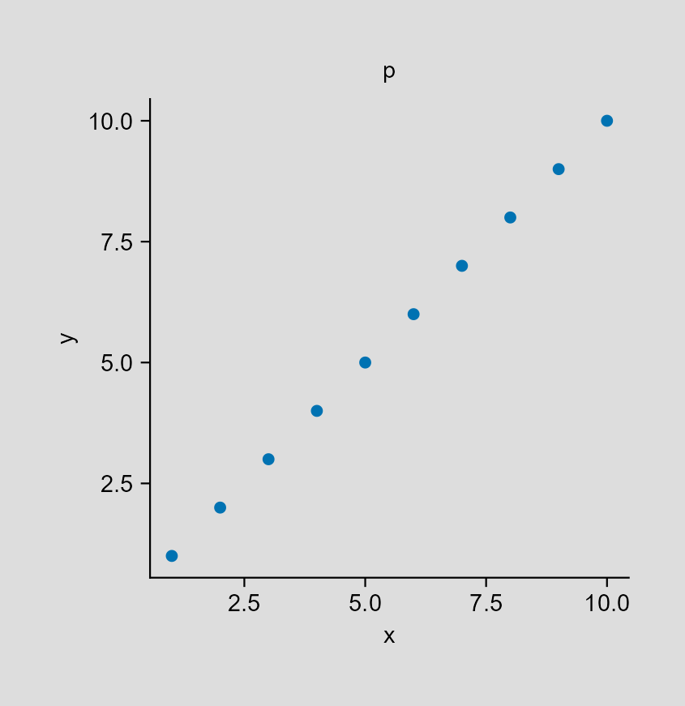
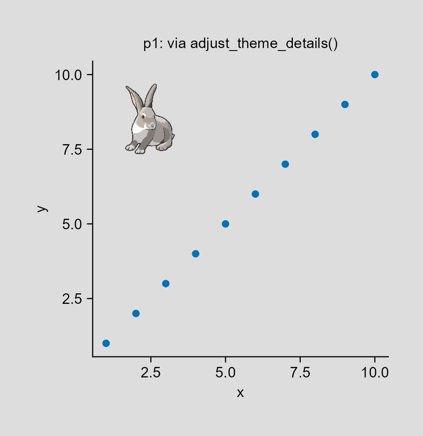
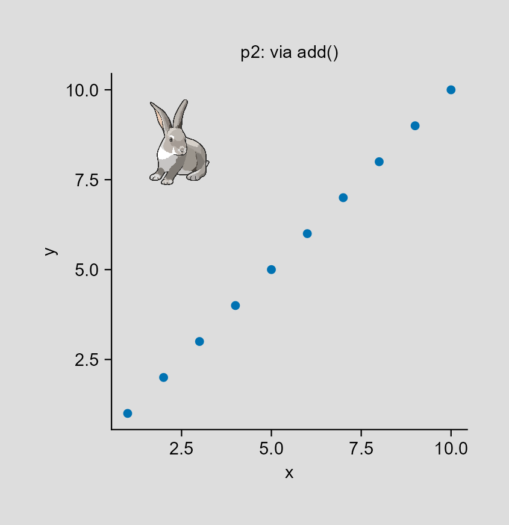
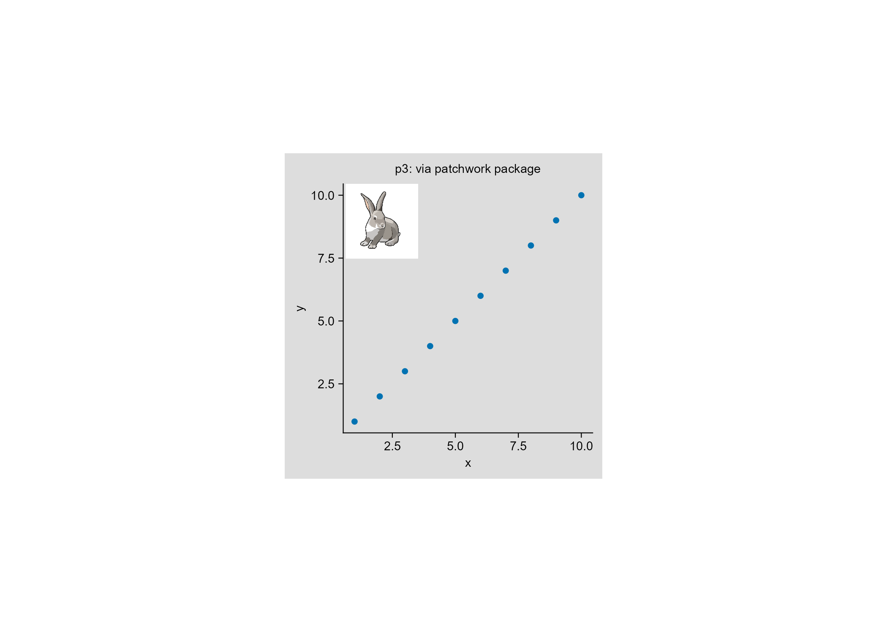
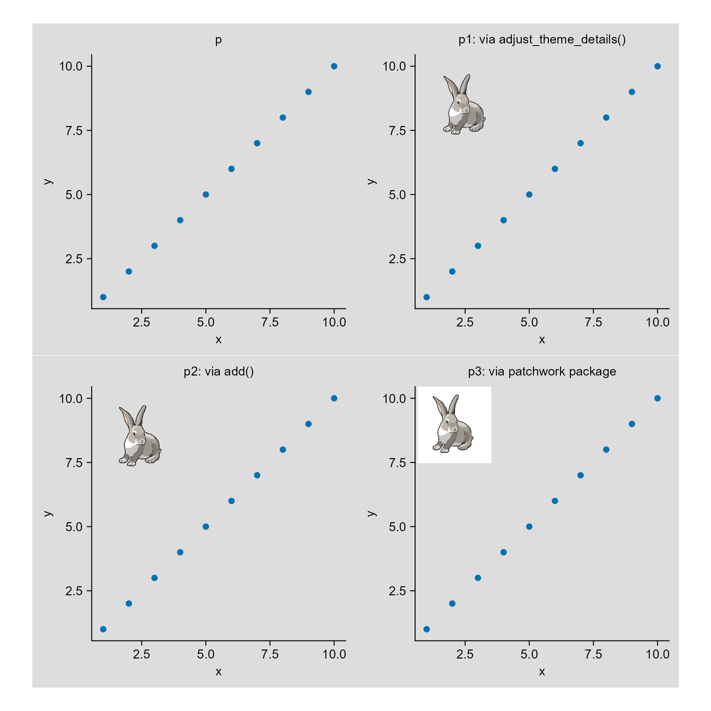

## 1. Generate a plot first

```{r}
tidyplots |> library()
tibble |> library()

# Generate a data frame
df <- tibble::tibble(
    x = seq(1, 10),
    y = seq(1, 10)
)

# Plot
p <- df |> 
    tidyplot(x = x, y = y, paper = "#dddddd") |> 
    add_title(title = "p") |> 
    add_data_points() |> 
    save_plot("images/2026-05-06_p.png", view_plot = FALSE)
```

<center>

</center>

## 2. Read the rabbit image

```{r}
magick |> library()

# The figure is from "https://bioart.niaid.nih.gov/bioart/668"
img <- "images/Rabbit0001.png" |> 
    magick::image_read()

img |> plot()
```

## 3. Inset rabbit image in tidyplots pot

### 3.1 Method 1: via `adjust_theme_details()` function [@tenu]
```{r}
grid |> library()
ggplot2 |> library()

img_m1 <- img |> 
    grid::rasterGrob(
        x = 0.2, y = 0.8, # geometric of img_m1
        width = unit(0.3, "snpc"), # snpc: square normalized parent coordinates
        height = unit(0.3, "snpc")
    ) |> 
    grid::pattern()

p1 <- p |> 
    tidyplots::adjust_theme_details(
        panel.background = element_rect(fill = img_m1)
    ) |> 
    tidyplots::add_title(title = "p1: via adjust_theme_details()") |> 
    tidyplots::save_plot("images/2026-05-06_via-adjust_theme.png",
        view_plot = FALSE)
```

<center>

</center>

### 3.2 Method 2: via `add()` function

```{r}
img_m2 <- img |> 
    grid::rasterGrob()

p2 <- p |> 
    tidyplots::add(annotation_custom(img_m2, xmin = 1, xmax = 4, ymin = 7, ymax = 10)) |> 
    tidyplots::add_title(title = "p2: via add()") |> 
    tidyplots::save_plot("images/2026-05-06_via-add.png",
        view_plot = FALSE)
```

<center>

</center>

### 3.3 Method 3: via patchwork package

```{r}
patchwork |> library()
p3 <- p |> 
    add_title(title = "p3: via patchwork package")

p3 <- p3 + 
    patchwork::inset_element(img_m2, left = 0.01, bottom = 0.7, right = 0.3, top = 1)

p3 |> 
    save_plot("images/2026-05-06_via-patchwork.png",
        view_plot = FALSE)
```

<center>

</center>

## 4. Conclusion

```{r}
patchwork::wrap_plots(p, p1, p2, p3, ncol = 2) |> 
    tidyplots::save_plot("images/2026-05-06_three-ways.png",
        view_plot = FALSE, width = 140, height = 140)
```

<center>

</center>

So, inset via `add()` function or `adjust_theme_details()` function is better than via patchwork package (if no further feature adjustments which I do not know).

[给我买杯茶🍵](给我买杯茶.qmd)

## References