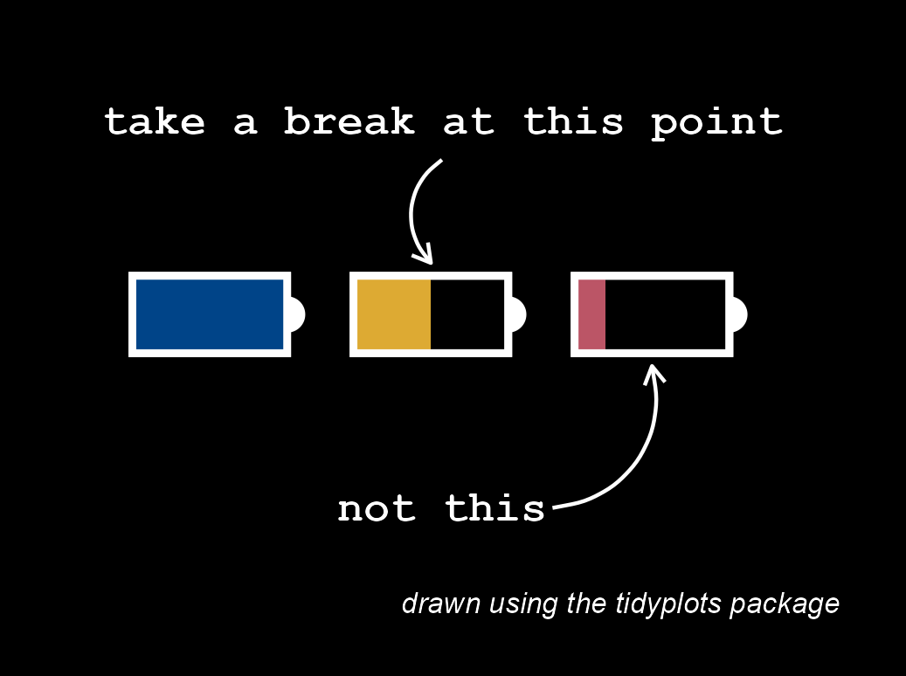

{width="100%" fig-align="center"}

```{r}
#| eval: false
library(tidyplots)

# Set a data frame
df <- tibble::tibble(
  x = c(1:3),
  y = 1
)

battery_width <- 0.7
battery_height_half <- 0.3

# Plot
df |> 
  tidyplot(
    x = x, 
    y = y, 
    paper = "#000000", 
    ink = "#ffffff") |> 
  add_data_points(size = 4, color = "#ffffff") |> 
  add_annotation_rectangle(
    xmin = df$x - battery_width,
    xmax = df$x,
    ymin = df$y - battery_height_half,
    ymax = df$y + battery_height_half,
    color = "#ffffff",
    fill = c("#000000", "#000000", "#000000"),
    alpha = 1,
    linewidth = 1) |> 
  add_annotation_rectangle(
    xmin = df$x - battery_width,
    xmax = df$x - c(0, battery_width/2, battery_width/5*4),
    ymin = df$y - battery_height_half,
    ymax = df$y + battery_height_half,
    color = NA,
    fill = c("#004488", "#ddaa33", "#bb5566"),
    alpha = 1,
    linewidth = 1) |>   
  add_annotation_rectangle(
    xmin = df$x - battery_width,
    xmax = df$x,
    ymin = df$y - battery_height_half,
    ymax = df$y + battery_height_half,
    color = "#ffffff",
    fill = c("#000000", "#000000", "#000000"),
    alpha = 0,
    linewidth = 1) |> 
  add_annotation_text(
    text = c("take a break at this point", "not this"),
    x = 1.7,
    y = c(2.5, -0.5),
    fontsize = 12,
    fontface = "bold",
    family = "mono"
  ) |> 
  add(ggplot2::annotate(
    "curve",
    x = c(1.7, 2.2),
    xend = c(1.65, 2.65),
    y = c(2.2, -0.5),
    yend = c(1.4, 0.6),
    linewidth = 0.5,
    arrow = grid::arrow(length = grid::unit(2, "mm")))) |> 
  adjust_caption(
    caption = "drawn using the tidyplots package", 
    fontsize = 8, 
    face = "italic") |> 
  adjust_y_axis(limits = c(-1, 3)) |> 
  adjust_x_axis(limits = c(0, 3.5)) |> 
  adjust_size(width = 75) |> 
  remove_x_axis() |> 
  remove_y_axis() |> 
  save_plot(
    "images/2026-05-21_take-a-break.png", 
    view_plot = FALSE)
```

[给我买杯茶🍵](给我买杯茶.qmd)