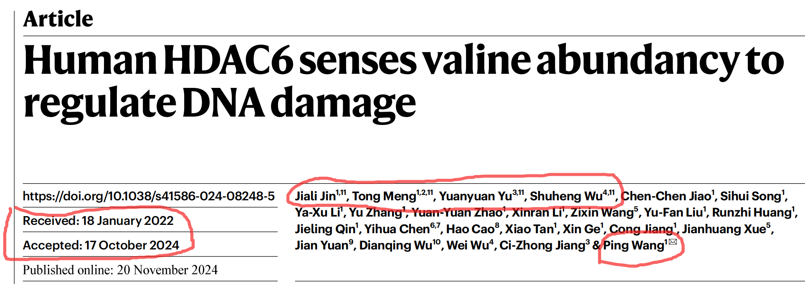
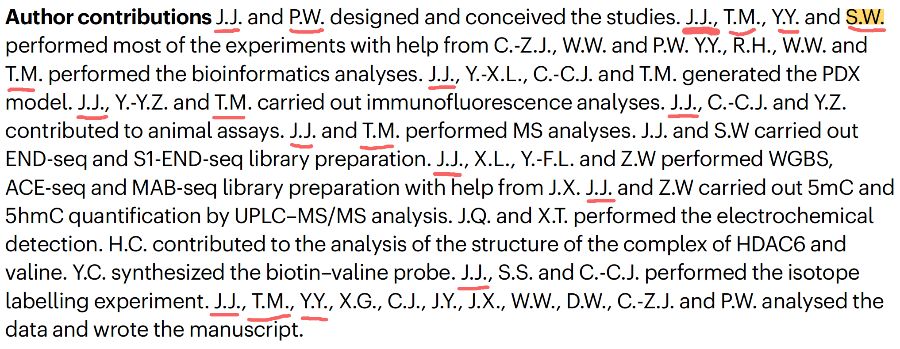
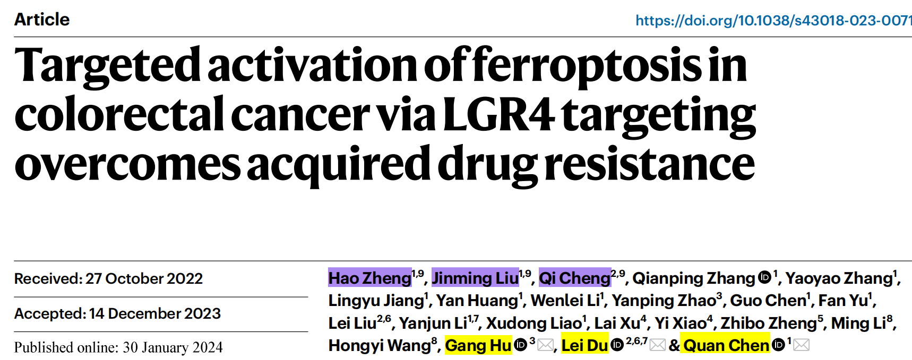

## 1. 同济的nature论文

该文章情况通报的链接见<https://news.tongji.edu.cn/info/1008/94355.htm>。

> 免去王某生命科学与技术学院院长职务，降低专业技术岗位等级两级，取消其在岗位聘用、工资晋级、职务晋升、科研项目申报、评奖评优等资格24个月。解除金某某与学校高等研究院聘用关系。

{width="100%" fig-align="center"}

{width="100%" fig-align="center"}

```{r}
#| message: false
#| eval: true
#| code-fold: true
library(lubridate)
library(dplyr)
library(tibble)

df <- tibble::tibble(
  received = lubridate::ymd("2022-01-18"),
  accepted = lubridate::ymd("2024-10-17"),
  days = accepted - received,
  ymd = lubridate::as.period(lubridate::interval(received, accepted))
)

df
```

几个点：

- 该文章2022-01-18日投稿，2024-10-17日接收，历时**1033天（2年8个月29天）**。可见经过了多少个压力巨大的日日夜夜。

- 并列第一作者共四位，分别是：Jiali Jin（J.J.）、Tong Meng（T.M.）、Yuanyuan Yu（Y.Y.）、和Shuheng Wu（S.W.）。

- 通讯作者仅是Ping Wang（P.W.）。

这个表格仅罗列并一和通讯作者参与的论文部分。

|Experiments|J.J.|T.M.|Y.Y.|S.W.|P.W.|
|---|---|---|---|---|---|
|Design and conceived the studies|+|-|-|-|+|
|Performed most of the experiments|+|+|+|+|-|
|Performed the bioinformatics analysis|-|+|+|-|-|
|Generated the PDX model|+|+|-|-|-|
|Carried out immunofluorescence analysis|+|+|-|-|-|
|Contributed to animal assays|+|-|-|-|-|
|Performed MS analyses|+|+|-|-|-|
|Carried out END-seq and S1-END-seq library preparation|+|-|-|-|-|
|Performed WGBS, ACE-seq and MAB-seq library preparation|+|-|-|-|-|
|Carried out 5mC and 5hmC quantification by UPLC-MS/MS analysis|+|-|-|-|-|
|Performed the isotope labelling experiment|+|-|-|-|-|
|Analysed the data and wrote the manuscript|+|+|+|-|+|

有两个问题：

- Y.Y.和S.W.能满足并列第一作者的标准吗？

- T.M.也参与了若干实验，其是否清楚清楚或参与了J.J. scientific misconduct过程？

## 2. 南开的nature cancer论文

该文章情况通报的链接见<https://news.tongji.edu.cn/info/1008/94355.htm>。

> 解除郑某与学校聘用关系。免去陈某生命科学学院院长职务，降低专业技术岗位等级，取消其在岗位聘用、工资晋级、职务晋升、科研项目申报、评奖评优等资格24个月。对胡某予以诫勉处理。

{width="100%" fig-align="center"}

```{r}
#| message: false
#| code-fold: true
#| eval: true
library(tibble)
library(lubridate)
library(dplyr)

df <- tibble::tibble(
  received = lubridate::ymd("2022-10-27"),
  accepted = lubridate::ymd("2023-12-14"),
  days = accepted - received,
  ymd = lubridate::as.period(lubridate::interval(received, accepted))
)

df
```

几个点：

- 该文章2022-10-27日投稿，2023-12-14日接收，历时**413天（1年1个月17天）**。可见经过了多少个压力巨大的日日夜夜。

- 并列第一作者共四位，分别是：Hao Zheng（H.Z.）、Jinming Liu（J.L.）、和Qi Cheng（Q.C.）。

- 通讯作者仅是Gang Hu（G.H.）、Lei Du（L.D.）、和Quan Chen（Q.Chen）。

这个表格仅罗列并一和通讯作者参与的论文部分。

|Experiments|H.Z.|J.L.|Q.C.|G.H.|L.D.|Q.Chen|
|---|---|---|---|---|---|---|
|Conceived and designed the project and supervised the research|-|-|-|-|+|+|
|Wrote the paper|+|-|-|-|+|+|
|Performed most of the experiments|+|+|-|-|-|-|
|Performed the bioinformatics analysis|-|-|-|+|-|-|
|Contributed to study design|-|-|+|-|-|-|

两个问题：

- Q.C.参与了研究设计，这就可以并列第一作者？

- J.L.参与了大部分实验，其是否清楚清楚或参与了H.Z. scientific misconduct过程？

[给我买杯茶🍵](给我买杯茶.qmd)