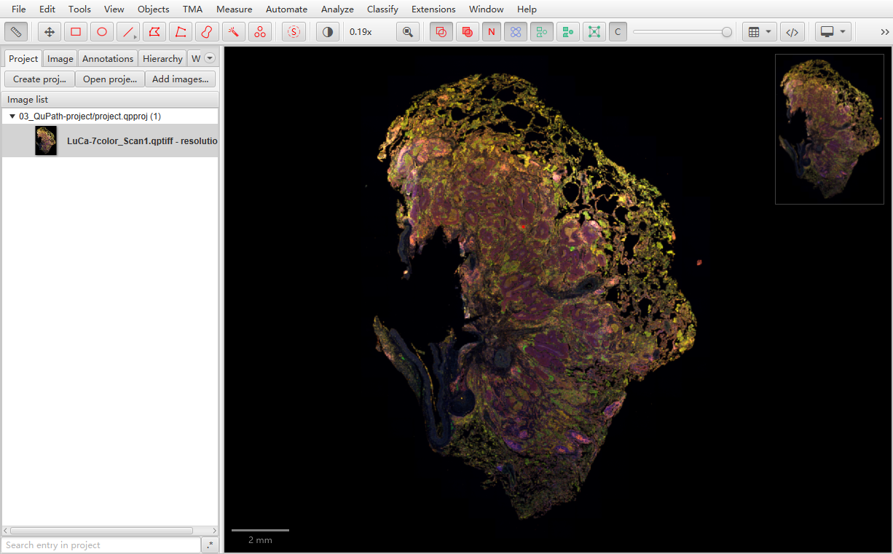
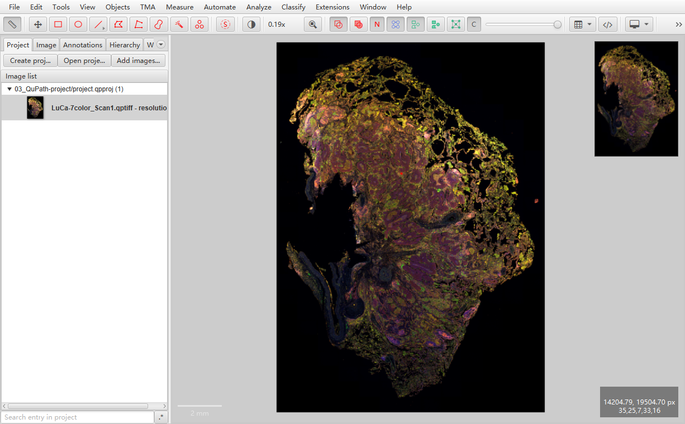
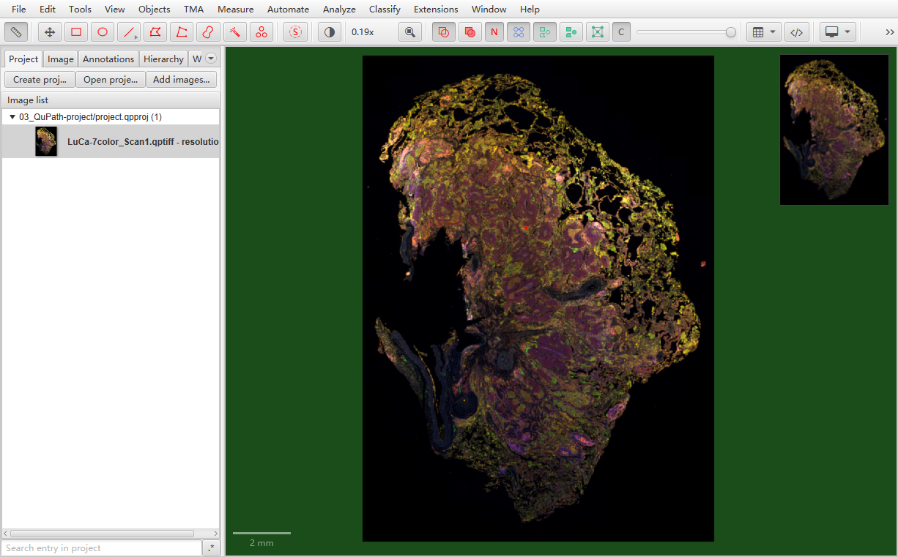

以这个图像为例，图像本身的背景为黑色，同时viewer背景色默认亦为黑色，因此无法明确图片的边缘。

{fig-align="center" width="100%"}

在`Edit` &rarr; `Preferences...` &rarr; `Viewer` &rarr; `Viewer background color`改变颜色（比如改为灰色`#cccccc`），则可以明确图像的边缘。但viewer背景和scalebar的区分度不明显。

{fig-align="center" width="100%"}

或者改变viewer背景色为绿色。同时viewer背景和scalebar的区分度也可以。

{fig-align="center" width="100%"}