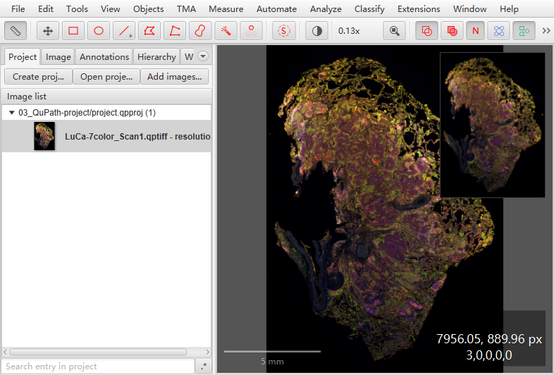
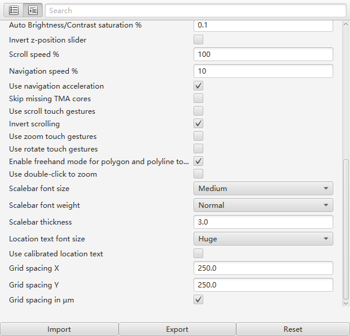

QuPath默认cursor location的坐标基准是µm（见下图右下角）。

{fig-align="center" width="100%"}

在`Edit` &rarr; `Preferences`，不要勾选`Use calibrated location text`。

另外，`Location text font size`可用于控制cursor location text的大小。本示例的`Location text font size`是`Huge`。

