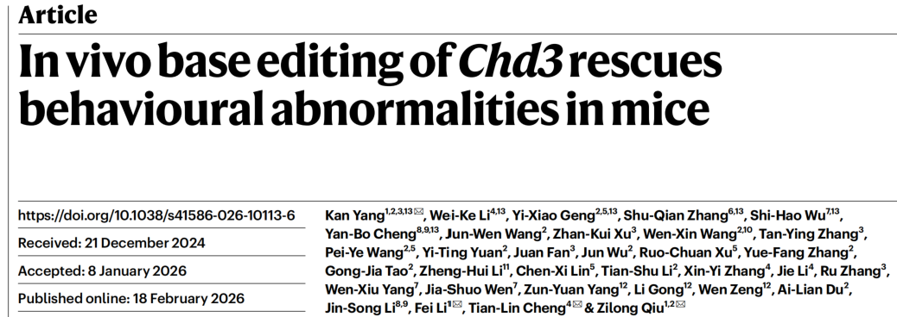
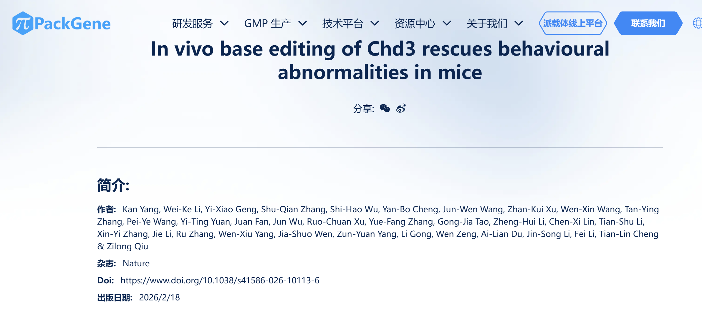

{fig-align="center" width="100%"}

## 1. 投稿历史

这个文章[@Yang2026]投稿于2024-12-21日，接收于2026-01-08。

```{r}
#| code-fold: true
df <- tibble::tibble(
    received = lubridate::ymd("2024-12-21"),
    accepted = lubridate::ymd("2026-01-08"),
    days = accepted - received,
    ymd = lubridate::as.period(lubridate::interval(received, accepted))
)

df
```

几个点：

- 该文章投稿于2024-12-21，接收于2026-01-08，历时383天（能发Nature，这个时间周期还好）。

- 并列第一作者（tagged with `13`）共6位；共同通讯作者（tagged with ✉️）共4位。`Kan Yang`既是并列第一作者，也是共同通讯作者。

- 并列第一单位共9个，对应的医院或大学/学院分别是：交大附属新华医院、交大附属松江医院、湖南工程学院、复旦大学附属儿科医院、交大基础医学院、山东大学附属齐鲁医院、云南大学医学院、中科院生化所、和上海理工大学生命科学与技术学院。

- 共同通讯单位共4个，对应的医院或大学/学院分别是：交大附属新华医院、交大附属松江医院、湖南工程学院、和复旦大学附属儿科医院。

## 2. AAV病毒在哪里生产的？

AAV质粒的设计和构建应该是在课题组实验室构建，之后病毒的包装和滴度测定由PackGene Bioscience（广州派真生物）完成[@packgene_nature]。

> The packaging of AAV viruses and titration were performed by PackGene Bioscience [@science_aav_girl].

{fig-align="center" width="100%"}

用于“小美”的AAV病毒是在哪里生产的？

> a Chinese affiliate of a U.S.-based firm that would start to make the viruses.

派真生物在美国的公司位于德克萨斯州休斯顿（不是说临床级AAV是在派真生物做的）。

## 3. Science报道[@science_aav_girl]里面关于付款给个人账户的相关描述

>  funded in part by [$860,000]{.mark} the parents had scraped together (凑钱) from their own savings and from relatives.

> More of their money ... flowed to a Chinese affiliate of a U.S.-based firm that would start to make the viruses, and to PriMed, a contract research organization in Sichuan province that would run the monkey studies.

> Qiu also asked the couple to [pay other members of the research team directly]{.mark}, through informal arrangements (非正式安排)

> In April 2024, at a Starbucks café near the university, Jason met with [Kang Yang]{.mark}, the researcher overseeing the lab work and a co-inventor in Qiu's Rett Syndrome (雷特综合征) patent, to discuss a fee schedule.

> ... charging for an unproven therapy is forbidden under Chinese law. The informed consent noted that [“Participation in this study will not incur any additional costs (产生任何额外费用) to you. All expenses will be borne by the sponsor (由赞助商承担), Lanqi Xintu Gene Technology.”]{.mark}

> The family ultimately sent [$130,000 directly to Yang's personal account]{.mark} over the course of the project, according to bank records.

> Jason always picked up the tab (支付账单) and gave Qiu multiple iPhones, an iPad, and a case of Maotai, a Chinese liquor made of sorghum (高粱) and wheat, according to family records.

> Yang [returned]{.mark} the full payment he received for the work (after Mei's death).

>  They submitted a complaint (at some time in 2026) to the dean of Qiu’s university, demanding an investigation and a retraction of the Nature paper “to prevent more children from suffering and our blood and tears flowing in vain.”

> On 30 April (2026), Jason and Linda received an emailed reply from the university, followed by a phone call: The dean's office was taking no action against Qiu. The payments made to Yang were [simply "research services fees"]{.mark} (研究服务费) for the clinical trial, though he was given a formal admonitory talk (正式警告谈话) for his behavior.

## 4. Science报道[@science_aav_girl]里面关于Zilong Qiu的描述

> His (Qiu) gene therapy for Rett syndrome had recently been patented in China, and he founded a company, [Lanqi Xintu Gene Technology]{.mark} ...

> Qiu also asked the couple to pay other members of the research team directly, [through informal arrangements]{.mark}

> Jason always picked up the tab and gave Qiu multiple iPhones, an iPad, and a case of Maotai, a Chinese liquor made of sorghum and wheat, according to family records.

> He was second only to Liu, he told the family, when it came to taking it (i.e. base editing) to new frontiers.

> After 3 days, Mei developed a fever ... Qiu swung by (顺便拜访) as her fever began to wane (消退) ... He assured Jason and Linda that their daughter’s condition would soon improve. As they walked him to the elevator, he announced—excitedly—that the Nature paper had been accepted with revisions. Then [he added that Mei’s treatment would make an even bigger splash (引人注目的效果): the first brain-directed gene-editing therapy.]{.mark}

> Over the next 24 hours ... Qiu, who had returned upon hearing of Mei’s problems, seemed unable to process it. ... Mei had died. Qiu was in shock ...

> Over the next few weeks, Linda and Jason say Qiu expressed his sadness to the family, but he was unwilling to speculate (推测) on what went wrong.

> The parents say they asked him to withdraw (撤回) the Nature paper out of concern that it could mislead other families with a similarly affected child, as well as researchers. [Qiu initially agreed]{.mark}. Eventually, they say, [he stopped responding to their queries]{.mark}.

> Although Qiu’s company had taken out insurance (购买保险) for the trial, the family said they were offered no compensation (赔偿金).

## 5. 小美的死因

> After 3 days, Mei developed a fever.

> Mei did not improve.

> Doctors took Mei for a full-body CT scan and then rushed her to the intensive care unit.

> The cause of death: [thrombotic microangiopathy（血栓性微血管病变）.]{.mark}

## 6. AAV专利的专利权人是谁？

这个Nature文章的主要单位见第1部分描述。

这个专利[@aav_patent]的专利权人则是中国科学院脑科学与智能技术卓越创新中心，发明人是Zilong Qiu和Kan Yang；申请日期是2022-02-25。

说明两位研究人员那时候及其之前的时间可能是在那里工作吧。Nature文章其实没有体现中国科学院脑科学与智能技术卓越创新中心这个单位。

## References